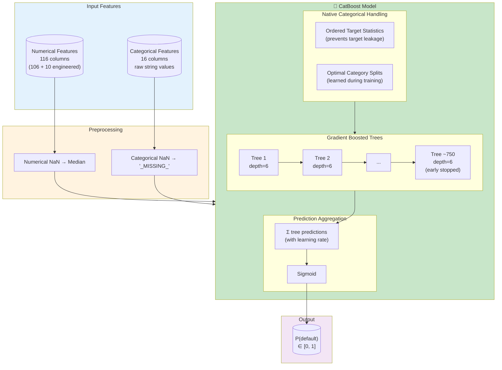
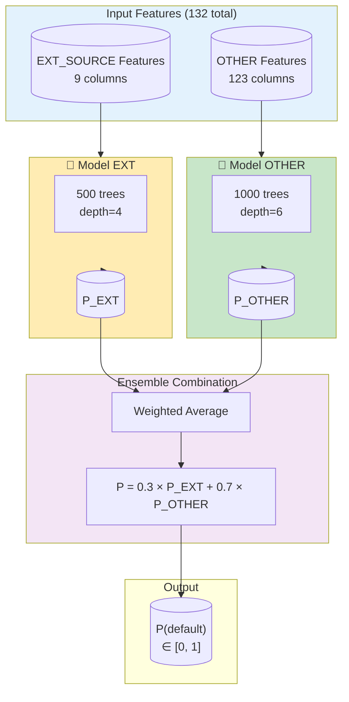
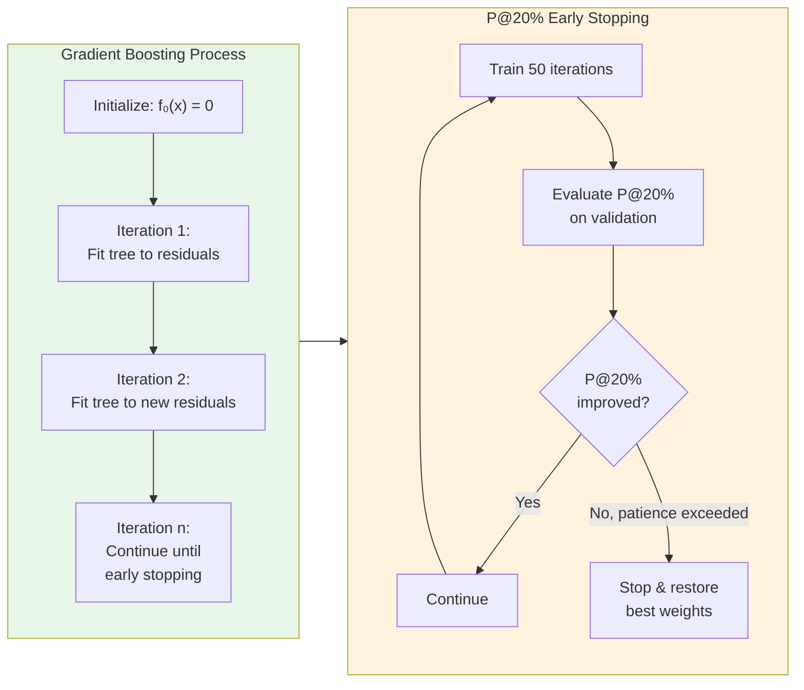
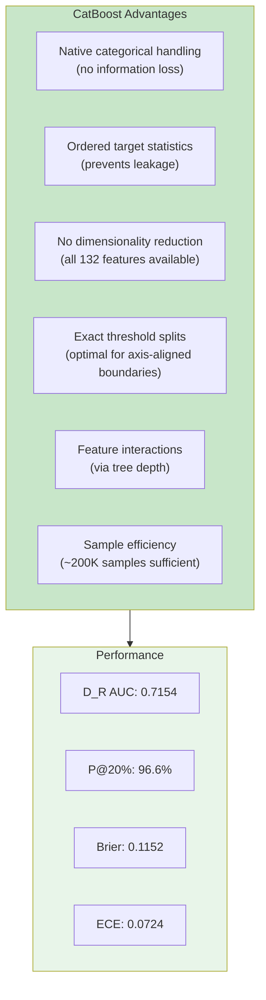

# CatBoost Architecture

## Single Model Architecture

## Ensemble Architecture

## Training Process

## Hyperparameters

### Single Model
| Parameter | Value | Purpose |
|-----------|-------|---------|
| Iterations | 2000 (max) | Maximum trees |
| Actual Iterations | ~750 | After early stopping |
| Depth | 6 | Tree depth |
| Learning Rate | 0.05 | Shrinkage |
| Loss | Logloss | Binary cross-entropy |
| Class Weights | {0: 0.75, 1: 0.25} | Imbalance handling |
| Early Stopping | P@20%, 200 rounds | |
| Categorical Features | 16 columns | Native handling |

### Ensemble
| Component | Model EXT | Model OTHER |
|-----------|-----------|-------------|
| Features | 9 | 123 |
| Iterations | 500 | 1000 |
| Depth | 4 | 6 |
| Early Stopping | 50 rounds | 100 rounds |
| Ensemble Weight | 0.3 | 0.7 |

## Why CatBoost Wins

