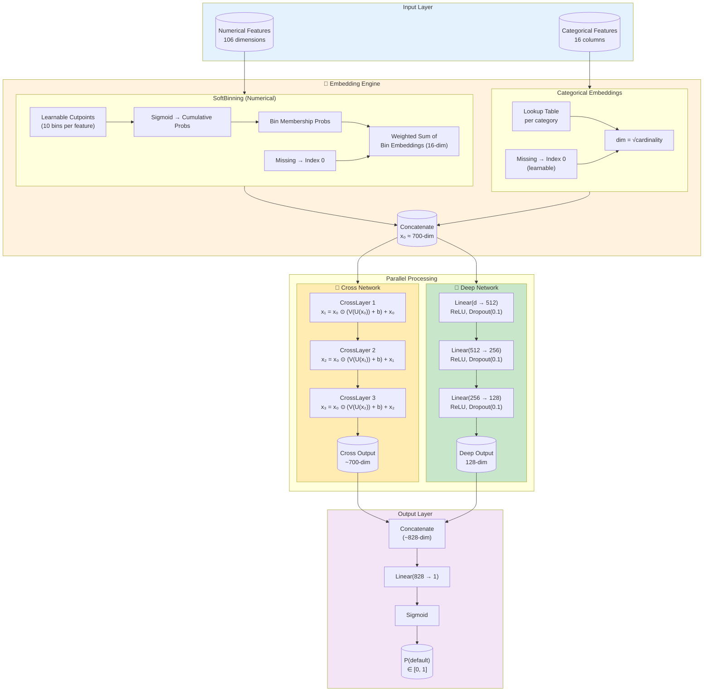
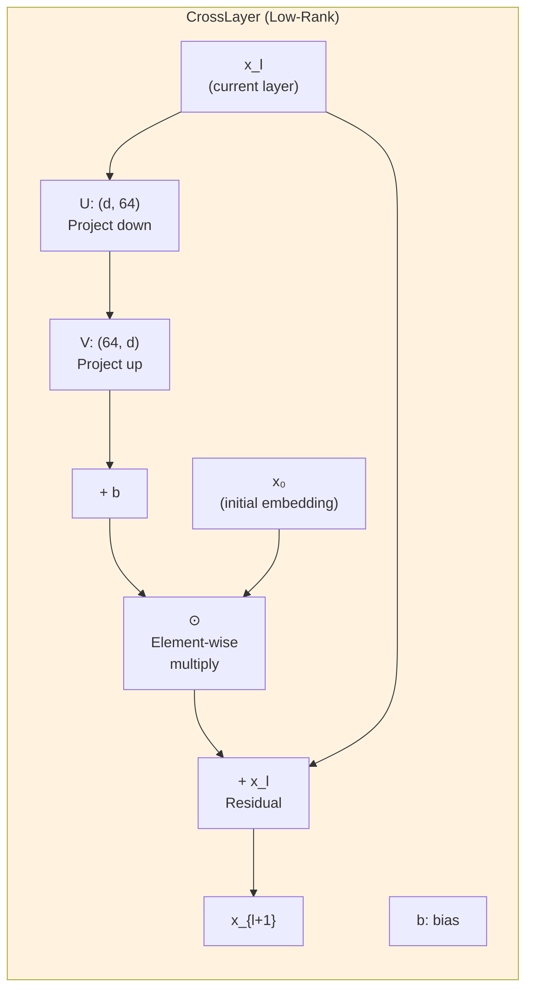
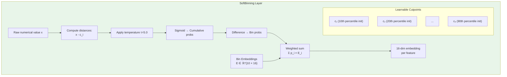
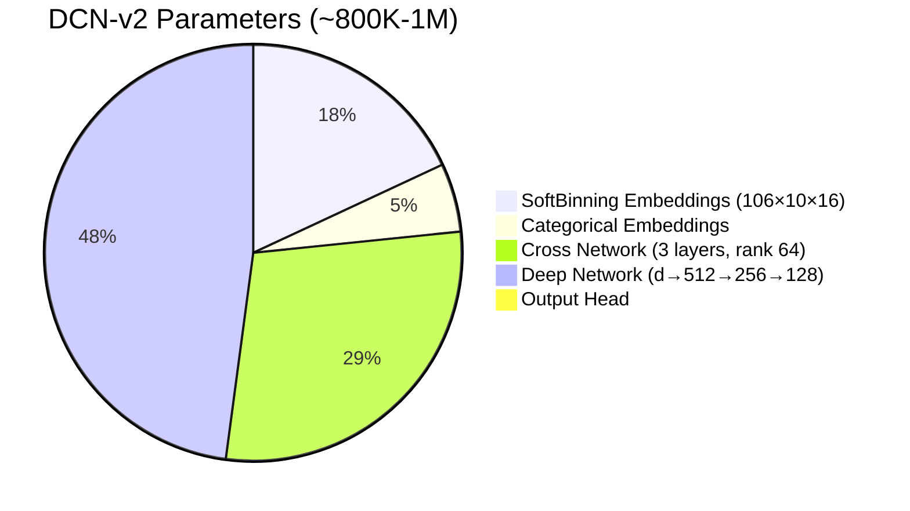

# DCN-v2 Architecture (Deep & Cross Network)

## Full Architecture

## Cross Layer Detail

## SoftBinning Detail

## Parameter Breakdown

## Hyperparameters

| Parameter | Value | Purpose |
|-----------|-------|---------|
| SoftBinning Bins | 10 | Learnable bin boundaries |
| SoftBinning Temperature | 5.0 | Soft-to-hard transition |
| Bin Embedding Dim | 16 | Per-feature embedding size |
| Cross Network Layers | 3 | 2nd to 4th order interactions |
| Cross Network Rank | 64 | Low-rank factorization |
| Deep Network | 512→256→128 | MLP layers |
| Dropout | 0.1 | Regularization |
| Loss | Focal (α=0.25, γ=2.0) | Class imbalance |
| Optimizer | AdamW | Weight decay 1e-5 |
| Batch Size | 1024 | |
| Early Stopping | P@20%, patience=10 | |
