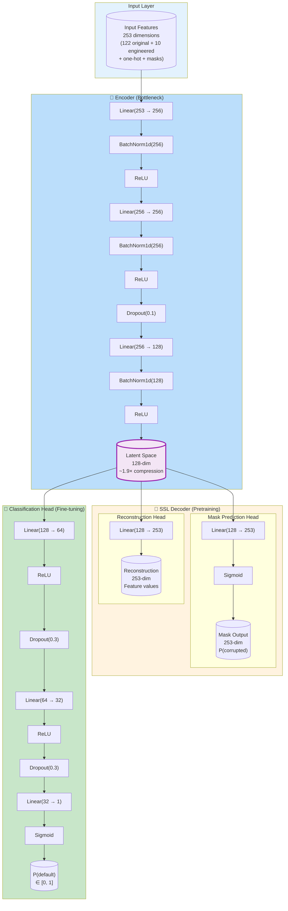
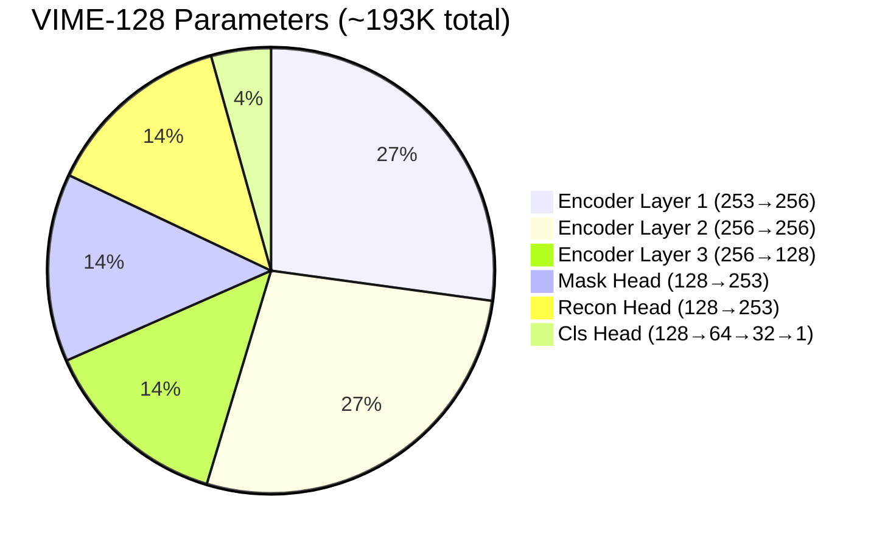
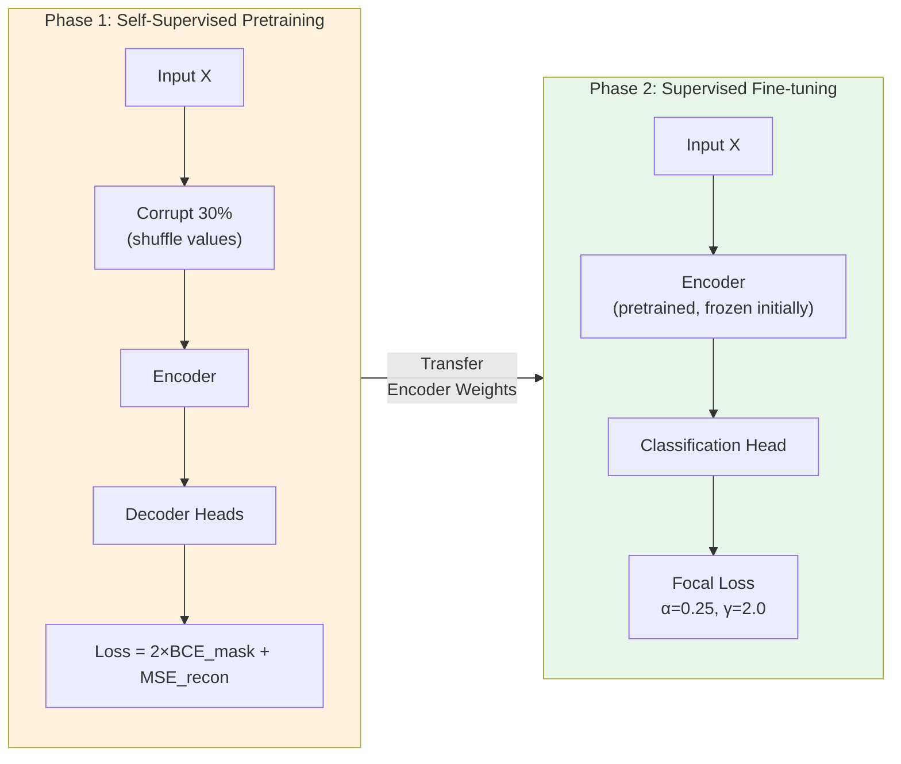

# VIME-128 Architecture

> **Note:** Two variants exist. The **original** VIME-128 used different training
> settings than VIME-512 (dropout 0.1, full MSE, small batches). The **Fair-v2**
> variant unifies all training variables with VIME-512, isolating architecture as
> the only difference. Fair-v2 is the recommended variant for comparison purposes.

## Full Architecture (SSL + Classification)

## Parameter Count Breakdown

## Training Pipeline

## Hyperparameters

### Original VIME-128

| Parameter | SSL Phase | Classification Phase |
|-----------|-----------|---------------------|
| Learning Rate | 1e-3 | 1e-3 |
| Batch Size | 128 | 256 |
| Epochs | 20 | 50 (early stop ~11) |
| Optimizer | Adam | Adam |
| Dropout (encoder) | 0.1 | 0.1 |
| Dropout (head) | - | 0.3 |
| Early Stopping | - | 10 epochs patience |
| Recon Loss | Full MSE | - |
| Mask Loss weight | 2.0 | - |
| Sup Loss | BCE | - |

### Fair-v2 VIME-128 (Recommended for Comparison)

| Parameter | SSL Phase | Classification Phase |
|-----------|-----------|---------------------|
| Learning Rate | 1e-3 | 1e-3 |
| Batch Size | 512 | 256 |
| Epochs | 30 | 50 (early stop ~6) |
| Optimizer | AdamW | AdamW |
| Dropout (encoder) | 0.3 | 0.3 |
| Dropout (head) | - | 0.3 |
| Early Stopping | - | 10 epochs patience (P@20%) |
| Recon Loss | Masked MSE | - |
| Mask Loss weight (α) | 1.0 | - |
| Sup Loss | - | Focal (α=0.25, γ=2.0) |

> **Why Fair-v2?** The original VIME-128 differed from VIME-512 in 6 training
> variables, making it impossible to attribute performance differences to
> architecture alone. Fair-v2 unifies all training settings, isolating only
> latent dim (128 vs 512), hidden dim (256 vs 512), and decoder depth.

## Results Comparison

| Variant | Model Class | D_R AUC | D_R P@20% | D_T AUC | Best Val AUC |
|---------|------------|---------|-----------|---------|--------------|
| **VIME-512-Fair-v3** | VIME | **0.7058** | **0.9591** | **0.7188** | **0.7285** |
| VIME-128-Fair-v2 | VIME | 0.6956 | 0.9588 | 0.7171 | 0.7310 |
| VIME-128 (original) | VIME | 0.6856 | 0.9522 | 0.7079 | 0.7213 |
| VIME-512 (G-Wide) | VIMEWide | 0.6822 | 0.9548 | 0.7125 | 0.7217 |

**Key findings (paired bootstrap, n=1000):**
- **512 > 128 (same class):** VIME-512-Fair-v3 significantly outperforms VIME-128-Fair-v2 (ΔAUC = +0.0102, 95% CI [+0.0080, +0.0125]). More capacity helps.
- **VIMEWide hurts:** VIME-512-Fair-v3 (simple VIME) outperforms VIME-512/G-Wide (VIMEWide) by ΔAUC = +0.0236. The mirror decoder architecture is harmful.
- **Architecture > capacity:** The mirror decoder effect (−0.0236) is 2× the capacity effect (+0.0102).
