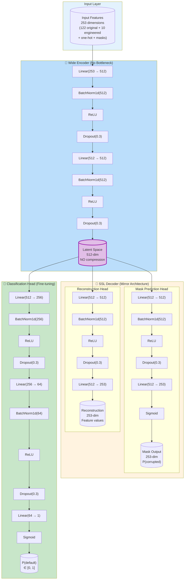
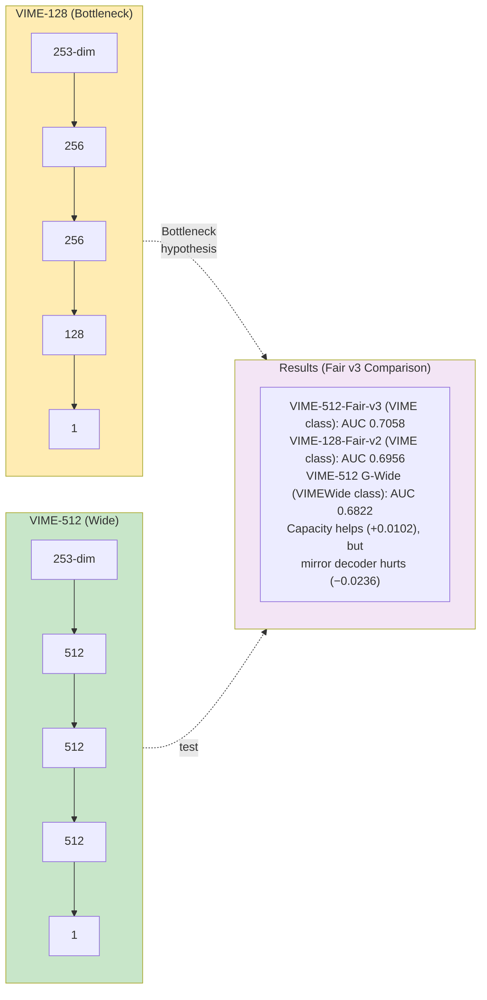
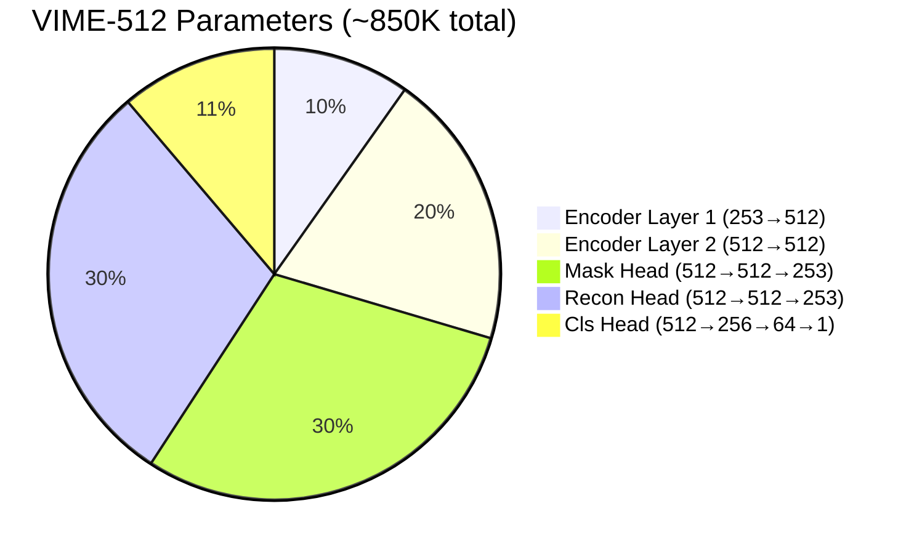
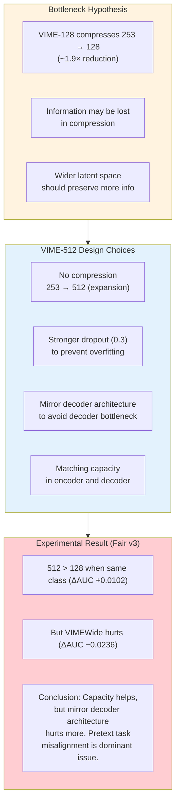

# VIME-512 Architecture (Wide Variant)

## Full Architecture (SSL + Classification)

## VIME-128 vs VIME-512 Comparison

## Parameter Count Breakdown

## Architecture Design Rationale

## Hyperparameters

| Parameter | VIME-128 (old) | Fair-v2 (128) | Fair-v3 (512) | G-Wide (512) |
|-----------|----------------|---------------|---------------|--------------|
| Model Class | VIME | VIME | **VIME** | VIMEWide |
| Encoder Layers | 3 | 3 | **3** | 2 |
| Decoder Layers | 1 (shallow) | 1 (shallow) | **1 (shallow)** | 2 (mirror) |
| Hidden Dimension | 256 | 256 | **512** | 512 |
| Latent Dimension | 128 | 128 | **512** | 512 |
| Encoder Dropout | 0.1 | 0.3 | **0.3** | 0.3 |
| Total Parameters | ~193K | ~193K | **~915K** | ~850K |
| SSL Epochs | 20 | 30 | **30** | 30 |
| SSL Alpha | 2.0 | 1.0 | **1.0** | 1.0 |
| SSL Batch Size | 128 | 512 | **512** | 512 |
| Cls Epochs (best) | 6 | 6 | **11** | 8 |
| D_R AUC | 0.6856 | 0.6956 | **0.7058** | 0.6822 |

*Fair-v3 uses the SAME VIME model class as Fair-v2, with only width changed. This eliminates all confounders except latent capacity.*
