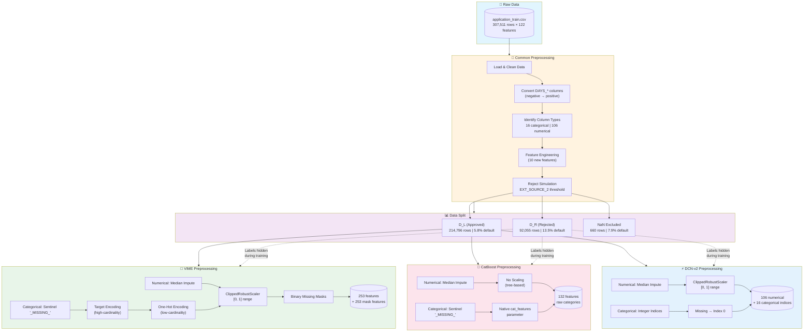
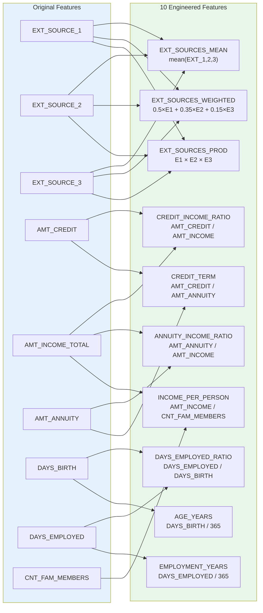
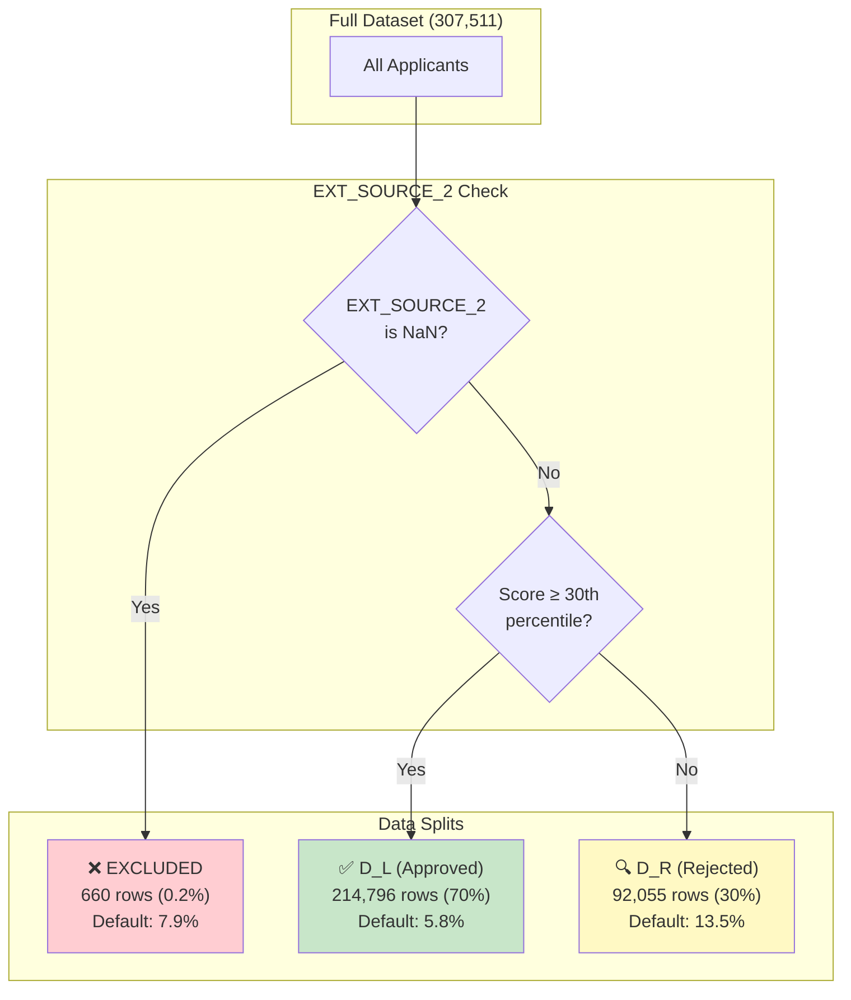

# Data Preprocessing Pipeline

## Overview Diagram

```mermaid
flowchart TB
    subgraph RAW["📁 Raw Data"]
        A[("application_train.csv<br/>307,511 rows × 122 features")]
    end

    subgraph COMMON["🔧 Common Preprocessing"]
        B["Load & Clean Data"]
        C["Convert DAYS_* columns<br/>(negative → positive)"]
        D["Identify Column Types<br/>16 categorical | 106 numerical"]
        E["Feature Engineering<br/>(10 new features)"]
        F["Reject Simulation<br/>EXT_SOURCE_2 threshold"]

        B --> C --> D --> E --> F
    end

    subgraph SPLIT["📊 Data Split"]
        G["D_L (Approved)<br/>214,796 rows | 5.8% default"]
        H["D_R (Rejected)<br/>92,055 rows | 13.5% default"]
        I["NaN Excluded<br/>660 rows | 7.9% default"]
    end

    subgraph VIME_PREP["🧠 VIME Preprocessing"]
        V1["Numerical: Median Impute"]
        V2["Categorical: Sentinel '_MISSING_'"]
        V3["Target Encoding<br/>(high-cardinality)"]
        V4["One-Hot Encoding<br/>(low-cardinality)"]
        V5["ClippedRobustScaler<br/>[0, 1] range"]
        V6["Binary Missing Masks"]
        V7[("253 features<br/>+ 253 mask features")]

        V1 --> V5
        V2 --> V3 --> V4 --> V5
        V5 --> V6 --> V7
    end

    subgraph CAT_PREP["🌲 CatBoost Preprocessing"]
        C1["Numerical: Median Impute"]
        C2["Categorical: Sentinel '_MISSING_'"]
        C3["No Scaling<br/>(tree-based)"]
        C4["Native cat_features<br/>parameter"]
        C5[("132 features<br/>raw categories")]

        C1 --> C3
        C2 --> C4
        C3 --> C5
        C4 --> C5
    end

    subgraph DCN_PREP["⚡ DCN-v2 Preprocessing"]
        D1["Numerical: Median Impute"]
        D2["Categorical: Integer Indices"]
        D3["ClippedRobustScaler<br/>[0, 1] range"]
        D4["Missing → Index 0"]
        D5[("106 numerical<br/>+ 16 categorical indices")]

        D1 --> D3 --> D5
        D2 --> D4 --> D5
    end

    A --> COMMON
    COMMON --> SPLIT
    F --> G
    F --> H
    F --> I

    G --> VIME_PREP
    G --> CAT_PREP
    G --> DCN_PREP

    H -.->|"Labels hidden<br/>during training"| VIME_PREP
    H -.->|"Labels hidden<br/>during training"| CAT_PREP
    H -.->|"Labels hidden<br/>during training"| DCN_PREP

    style RAW fill:#e1f5fe
    style COMMON fill:#fff3e0
    style SPLIT fill:#f3e5f5
    style VIME_PREP fill:#e8f5e9
    style CAT_PREP fill:#fce4ec
    style DCN_PREP fill:#e3f2fd
```

## Feature Engineering Details

```mermaid
flowchart LR
    subgraph INPUT["Original Features"]
        EXT1["EXT_SOURCE_1"]
        EXT2["EXT_SOURCE_2"]
        EXT3["EXT_SOURCE_3"]
        AMT_C["AMT_CREDIT"]
        AMT_I["AMT_INCOME_TOTAL"]
        AMT_A["AMT_ANNUITY"]
        DAYS_B["DAYS_BIRTH"]
        DAYS_E["DAYS_EMPLOYED"]
        CNT_F["CNT_FAM_MEMBERS"]
    end

    subgraph ENGINEERED["10 Engineered Features"]
        E1["EXT_SOURCES_MEAN<br/>mean(EXT_1,2,3)"]
        E2["EXT_SOURCES_WEIGHTED<br/>0.5×E1 + 0.35×E2 + 0.15×E3"]
        E3["EXT_SOURCES_PROD<br/>E1 × E2 × E3"]
        E4["CREDIT_INCOME_RATIO<br/>AMT_CREDIT / AMT_INCOME"]
        E5["ANNUITY_INCOME_RATIO<br/>AMT_ANNUITY / AMT_INCOME"]
        E6["CREDIT_TERM<br/>AMT_CREDIT / AMT_ANNUITY"]
        E7["DAYS_EMPLOYED_RATIO<br/>DAYS_EMPLOYED / DAYS_BIRTH"]
        E8["INCOME_PER_PERSON<br/>AMT_INCOME / CNT_FAM_MEMBERS"]
        E9["AGE_YEARS<br/>DAYS_BIRTH / 365"]
        E10["EMPLOYMENT_YEARS<br/>DAYS_EMPLOYED / 365"]
    end

    EXT1 & EXT2 & EXT3 --> E1
    EXT1 & EXT2 & EXT3 --> E2
    EXT1 & EXT2 & EXT3 --> E3
    AMT_C & AMT_I --> E4
    AMT_A & AMT_I --> E5
    AMT_C & AMT_A --> E6
    DAYS_E & DAYS_B --> E7
    AMT_I & CNT_F --> E8
    DAYS_B --> E9
    DAYS_E --> E10

    style INPUT fill:#e3f2fd
    style ENGINEERED fill:#e8f5e9
```

## Reject Simulation Logic

```mermaid
flowchart TB
    subgraph INPUT["Full Dataset (307,511)"]
        ALL["All Applicants"]
    end

    subgraph CHECK["EXT_SOURCE_2 Check"]
        NAN{"EXT_SOURCE_2<br/>is NaN?"}
        THRESHOLD{"Score ≥ 30th<br/>percentile?"}
    end

    subgraph OUTPUT["Data Splits"]
        EXCLUDED["❌ EXCLUDED<br/>660 rows (0.2%)<br/>Default: 7.9%"]
        D_L["✅ D_L (Approved)<br/>214,796 rows (70%)<br/>Default: 5.8%"]
        D_R["🔍 D_R (Rejected)<br/>92,055 rows (30%)<br/>Default: 13.5%"]
    end

    ALL --> NAN
    NAN -->|Yes| EXCLUDED
    NAN -->|No| THRESHOLD
    THRESHOLD -->|Yes| D_L
    THRESHOLD -->|No| D_R

    style EXCLUDED fill:#ffcdd2
    style D_L fill:#c8e6c9
    style D_R fill:#fff9c4
```
