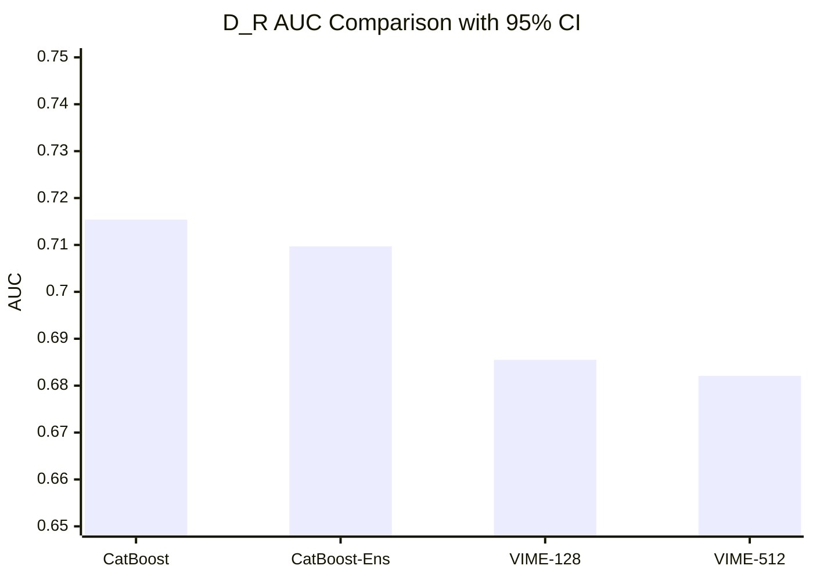
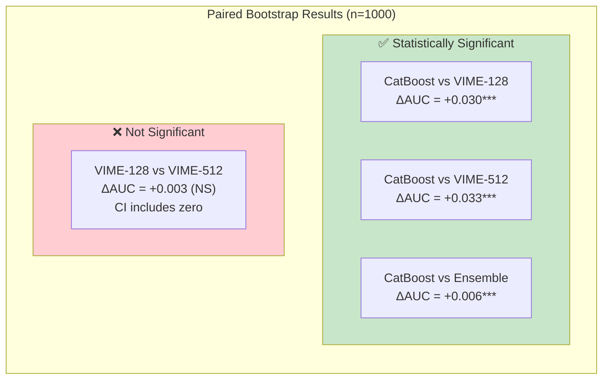
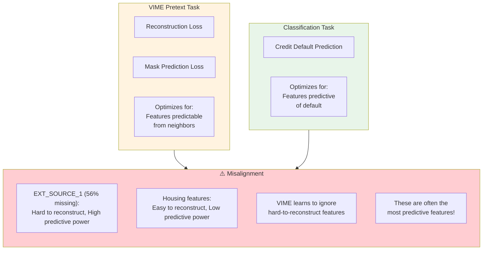
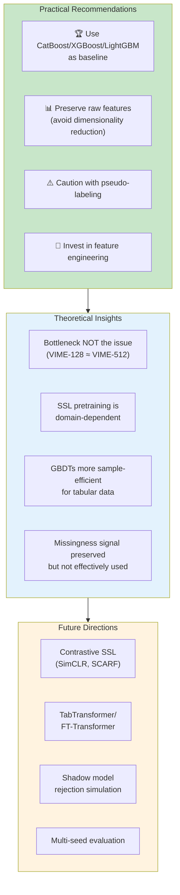

# Research Overview: Reject Inference for Credit Risk

## Research Process Flow

```mermaid
flowchart TB
    subgraph PROBLEM["1️⃣ Problem Definition"]
        P1["Reject Inference Challenge"]
        P2["Only approved applicants<br/>have observed outcomes"]
        P3["Goal: Find 'diamonds'<br/>in rejected population"]
    end

    subgraph QUESTIONS["2️⃣ Research Questions"]
        Q1["RQ1: Can SSL (VIME)<br/>improve reject inference?"]
        Q2["RQ2: Does 128-dim<br/>bottleneck limit VIME?"]
        Q3["RQ3: Can DCN-v2<br/>match GBDTs?"]
        Q4["RQ4: Best practical<br/>approach?"]
    end

    subgraph METHODS["3️⃣ Methodology"]
        M1["Dataset: Home Credit<br/>307K applications"]
        M2["Reject Simulation<br/>EXT_SOURCE_2 < 30th percentile"]
        M3["Fair Comparison<br/>Focal Loss + P@20% early stop"]
        M4["Paired Bootstrap<br/>n=1000, 95% CI"]
    end

    subgraph MODELS["4️⃣ Models Compared"]
        MOD1["VIME-128<br/>(bottleneck SSL)"]
        MOD2["VIME-512<br/>(wide SSL)"]
        MOD3["DCN-v2<br/>(deep & cross)"]
        MOD4["CatBoost<br/>(single)"]
        MOD5["CatBoost<br/>(ensemble)"]
    end

    subgraph RESULTS["5️⃣ Key Results"]
        R1["CatBoost: AUC 0.715"]
        R2["VIME-128: AUC 0.686"]
        R3["VIME-512: AUC 0.682"]
        R4["Δ CatBoost-VIME: +0.030***"]
        R5["Δ VIME128-512: +0.003 (NS)"]
    end

    subgraph CONCLUSIONS["6️⃣ Conclusions"]
        C1["✅ GBDT outperforms<br/>neural networks"]
        C2["❌ Bottleneck NOT<br/>the limiting factor"]
        C3["⚠️ Pretext task<br/>misalignment"]
        C4["📊 Practical: Use CatBoost"]
    end

    PROBLEM --> QUESTIONS --> METHODS --> MODELS --> RESULTS --> CONCLUSIONS

    style PROBLEM fill:#e3f2fd
    style QUESTIONS fill:#fff3e0
    style METHODS fill:#f3e5f5
    style MODELS fill:#e8f5e9
    style RESULTS fill:#ffecb3
    style CONCLUSIONS fill:#c8e6c9
```

## Hypothesis Testing Framework

```mermaid
flowchart TB
    subgraph H1["Hypothesis 1: SSL Benefits"]
        H1_CLAIM["VIME SSL pretraining<br/>improves reject inference"]
        H1_TEST["Compare VIME vs CatBoost"]
        H1_RESULT["❌ REJECTED<br/>CatBoost significantly better<br/>ΔAUC = +0.030 [+0.026, +0.034]"]
    end

    subgraph H2["Hypothesis 2: Bottleneck Limitation"]
        H2_CLAIM["128-dim bottleneck<br/>limits VIME performance"]
        H2_TEST["Compare VIME-128 vs VIME-512"]
        H2_RESULT["❌ NOT SUPPORTED<br/>No significant difference<br/>ΔAUC = +0.003 [-0.0004, +0.007]"]
    end

    subgraph H3["Hypothesis 3: Deep Learning Parity"]
        H3_CLAIM["Modern DL (DCN-v2)<br/>matches GBDTs"]
        H3_TEST["Compare DCN-v2 vs CatBoost"]
        H3_RESULT["❌ REJECTED<br/>CatBoost better<br/>(DCN-v2 not in bootstrap)"]
    end

    subgraph H4["Hypothesis 4: Ensemble Benefits"]
        H4_CLAIM["Ensemble improves<br/>over single model"]
        H4_TEST["Compare CatBoost vs Ensemble"]
        H4_RESULT["❌ REJECTED<br/>Single model better<br/>ΔAUC = +0.006 [+0.003, +0.009]"]
    end

    H1_CLAIM --> H1_TEST --> H1_RESULT
    H2_CLAIM --> H2_TEST --> H2_RESULT
    H3_CLAIM --> H3_TEST --> H3_RESULT
    H4_CLAIM --> H4_TEST --> H4_RESULT

    style H1 fill:#ffcdd2
    style H2 fill:#ffcdd2
    style H3 fill:#ffcdd2
    style H4 fill:#ffcdd2
```

## Model Performance Comparison

## Statistical Significance Matrix

## Key Insight: Pretext Task Misalignment

## Final Recommendations

## Summary Table

| Metric | CatBoost | CatBoost-Ens | VIME-128 | VIME-512 |
|--------|----------|--------------|----------|----------|
| **D_R AUC** | **0.7154** | 0.7097 | 0.6855 | 0.6821 |
| **95% CI** | [0.711, 0.720] | [0.705, 0.714] | [0.681, 0.690] | [0.677, 0.687] |
| **P@20%** | **96.6%** | 96.4% | 95.2% | 95.6% |
| **Brier** | **0.115** | 0.123 | 0.123 | 0.122 |
| **ECE** | **0.072** | 0.092 | 0.105 | 0.096 |
| **Parameters** | N/A (trees) | N/A (trees) | 193K | 850K |
| **Winner** | ✅ | | | |
