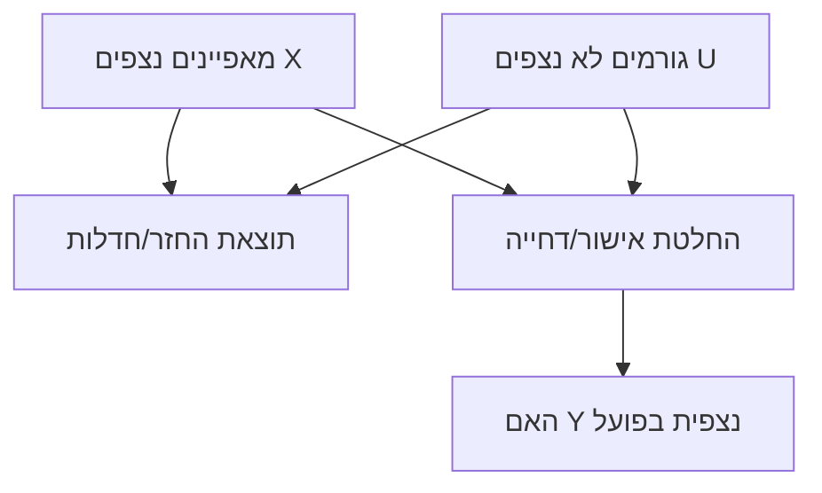

# ביקורת מתודולוגית וסטטיסטית על הדוח המצורף בנושא Reject Inference בסיכון אשראי

## תקציר מנהלים

הדוח המצורף מציג עבודת קורס (17 בפברואר 2026) שבוחנת “Reject Inference” בסיכון אשראי באמצעות סימולציה על נתוני תחרות Kaggle, ומשווה בין מודלים מבוססי עצים (CatBoost) לבין שתי ארכיטקטורות של רשתות נוירונים לטבלאות (VIME ו‑DCN‑v2). fileciteturn0file0 מבחינת תוצאה אמפירית בתוך הסימולציה שנבחרה, CatBoost מוביל על סט “נדחים” (D_R) במדדי AUC וב‑Precision@20% עם הבדלי ביצועים שאינם קטנים (למשל ΔAUC≈0.025 מול VIME‑128, ו‑ΔPrecision@20%≈0.0115 שהם כ‑213 “לווים טובים” נוספים בטופ‑20% מתוך 92,715 נדחים). fileciteturn0file0

עם זאת, כאשר מאתגרים את התהליך המחקרי באופן ביקורתי, עולים מספר סיכונים מתודולוגיים שמחלישים את תוקף המסקנות הכלליות (“GBDT עדיף עקבי”, “Self‑supervised לא עוזר לטבלאי”, “הבוטלנק אינו מגביל”): (א) מנגנון הדחייה בסימולציה הוא כלל חד‑ממדי המבוסס על תכונה אחת (EXT_SOURCE_2), ולכן יוצר הטיית מבנה (inductive‑bias confounding) שעלולה להעדיף עצים; (ב) רוב ההסקה הסטטיסטית נשענת על CIs בוטסטרפ לא‑מצומדים ואבחון “חפיפה/אי‑חפיפה” במקום השוואת ביצועים מצומדת (paired) על אותן דגימות—דבר שאינו מבחן פורמלי להבדל בין מודלים; (ג) קיימות אי‑עקביות תיאוריות לגבי מה בדיוק הוזן ל‑CatBoost (טיפול קטגוריאלי/חוסרים “טבעי” מול אימפוטציה ו‑target encoding), מה שמקשה על שחזור ועל פירוש “הוגנות ההשוואה”. fileciteturn0file0 citeturn2search3turn7search13

במונחים של ספרות מקצועית, התוצאה ש‑GBDT חזק מאוד על נתונים טבלאיים אכן מתיישבת עם בנצ’מרקים רחבי‑היקף שמראים יתרון מתמשך של מודלי‑עצים על טבלאי “בינוני” ותלות חזקה בפרוטוקול הטיונינג. citeturn2search2turn4search4 יחד עם זאת, אותם בנצ’מרקים וגם מחקרים נוספים מדגישים שאין “פתרון על” אוניברסלי: רשתות מותאמות לטבלאי (למשל FT‑Transformer/TabTransformer) ולעיתים גם ארכיטקטורות פשוטות יותר, יכולות להתקרב ואף לנצח על סטים מסוימים—במיוחד תחת טיונינג מוקפד. citeturn4search4turn4search6turn3search1

במישור “Reject inference” עצמו, הספרות הקלאסית והסקירות מצביעות על בעיית זיהוי (identifiability) ומנגנון חסרים לא‑אקראי (MNAR) כשסטטוס “נדחה” תלוי גם במשתנים לא נצפים; לכן היכולת להסיק “אמת” על נדחים מוגבלת ללא הנחות חזקות/מידע חיצוני, ולעיתים התועלת המעשית של טכניקות reject inference צנועה או לא עקבית. citeturn11search0turn2search1turn11search5turn11search3

## מיפוי המחקר בדוח המצורף

להלן מיפוי מרכיבי המחקר כפי שהם מתוארים בדוח, יחד עם נקודות שחסרות/לא מפורטות דיין לצורך ביקורת ושחזור. fileciteturn0file0

| רכיב מחקרי | מה מדווח בדוח | מה חסר/עמום (משמעות לביקורת) |
|---|---|---|
| שאלות מחקר | (1) האם VIME (Self‑supervised ללמידה טבלאית) משפר reject inference? (2) האם bottleneck של 128 ממד מגביל והרחבה ל‑512 תעזור? (3) האם DCN‑v2 יכול להשתוות/לעקוף GBDT? (4) מה הגישה הפרקטית הטובה ביותר? fileciteturn0file0 | אין ניסוח מפורש של היפותזות כמותיות (למשל “שיפור AUC ≥ X”) או קריטריוני הצלחה פריורי, מה שמגדיל גמישות פרשנית (researcher degrees of freedom). citeturn13search12turn13search33 |
| מקור נתונים | נתוני “Home Credit Default Risk” מתחרות entity["company","Kaggle","ml competition platform"]: 307,511 דגימות, 122 תכונות, סיווג בינארי (TARGET). fileciteturn0file0 | בדוח עצמו לא מצורף “datasheet” מלא: גרסת קובץ, checksum, תהליך ניקוי, יחס דגימות שהושמטו, ופרטי split רנדומי מול time‑split (קריטי בסיכון אשראי). citeturn13search12turn13search0 |
| הגדרת הדחייה (Reject simulation) | דחייה סינתטית לפי EXT_SOURCE_2: תחתית 30% → D_R (92,715), עליונים 70% → D_L (214,796). חוסרים ב‑EXT_SOURCE_2 נדחים אוטומטית. שיעור חדלות פירעון ב‑D_R גבוה יותר. fileciteturn0file0 | זהו מנגנון דחייה חד‑ממדי הנשלט ע"י תכונה יחידה, ולא ע"י מדיניות רב‑ממדית עם רעש/שיקולים עסקיים. זה עלול “לנעול” את ניסוי ההשוואה בתוך הטיה מבנית. citeturn2search2turn11search0 |
| דגימה וחלוקות | D_L_train / D_L_val / D_L_test והערכת reject על D_R. fileciteturn0file0 | לא ברור אם ההנדסה/אימפוטציה/קידוד (כולל target encoding) הותאמו רק על train (נדרש למניעת leakage). citeturn7search10turn2search3 |
| “כלי מדידה” (אינסטרומנטים) | AUC‑ROC, Precision@20% (“לווים טובים” בטופ‑20% סיכון נמוך), ומספר “Diamonds” בטופ‑20%. fileciteturn0file0 | אין התאמה מפורשת למדד עסקי (עלות/תועלת), אין בחינה של יציבות סף/תיאבון סיכון, ואין מדדי כיול הסתברות (Brier/ECE) בפועל—רק המלצה לבצע. fileciteturn0file0 citeturn14search0turn12search3turn12search7 |
| שיטות ניתוח | השוואת ביצועים על D_R; בוטסטרפ (n=1000) ל‑CI פרסנטילי עבור AUC/P@20/Diamonds; קביעה של “מובהקות” לפי חפיפת CIs. fileciteturn0file0 | זו אינה בדיקת הבדל מצומדת בין מודלים. יש צורך ב‑paired bootstrap או DeLong על אותן דגימות, ובפרט להערכת CI לדלתא (Δmetric) ולא לשני CIs נפרדים. citeturn5search2turn3search14turn5search7 |
| מסקנות עיקריות | CatBoost עדיף באופן מובהק; הגדלת bottleneck לא שיפרה VIME; DCN‑v2 לא עקף; המלצה מעשית: “להעדיף GBDT” ולשים דגש על feature engineering. fileciteturn0file0 | המסקנה “GBDT עדיף באופן עקבי” חורגת מהיקף הניסוי (דאטה יחיד, מנגנון דחייה יחיד, טיונינג מוגבל), ובספרות יש עדויות לתלות‑דאטה ולצורך פרוטוקולי טיונינג אחידים. citeturn2search2turn4search4 |

תרשים זרימת התהליך המחקרי כפי שעולה מהדוח (ברמת‑על):

```mermaid
flowchart LR
    A[נתוני בקשות אשראי טבלאיים] --> B[סימולציית דחייה לפי ציון חיצוני]
    B --> C1[D_L: מאושרים עם תוויות]
    B --> C2[D_R: נדחים ללא תוויות באימון]
    C1 --> D[קדם-עיבוד והנדסת תכונות]
    D --> E[אימון מודלים]
    C2 --> F[הערכה על D_R (בסימולציה קיימות תוויות)]
    E --> F
    F --> G[בוטסטרפ לרווחי סמך והשוואה]
```

## ביקורת מתודולוגית

הביקורת להלן מתמקדת בתוקף פנימי/חיצוני, תוקף מבנה, מהימנות, והטיות אפשריות—ביחס לטענות הדוח. fileciteturn0file0

**תוקף פנימי: מנגנון הדחייה יוצר הטיית מבנה שמבלבלת בין “יכולת reject inference” לבין “התאמה אינדוקטיבית למרחב החלטה”.**  
הסימולציה מגדירה דחייה לפי סף חד‑ממדי של EXT_SOURCE_2, כלומר הגבול בין D_L ל‑D_R הוא “axis‑aligned” ותלוי תכונה אחת. fileciteturn0file0 ידוע שבטבלאי, מודלי עצים נהנים מהטיות אינדוקטיביות שמקלות על למידת פונקציות לא‑חלקות ותלויות‑אוריינטציה (כמו חיתוכים לאורך צירים), בעוד רשתות עלולות להזדקק לטיונינג/קיבולת/ייצוגים אחרים כדי להגיע לאותה יכולת. citeturn2search2turn4search4 לכן, גם אם התוצאה “CatBoost מנצח” אמיתית בתוך ההגדרה הזו, היא לא “מבודדת” את תרומת self‑supervision ל‑reject inference, אלא מערבבת אותה עם התאמה מבנית של משפחת מודלים לסוג הגבול שנוצר.

**תוקף פנימי: ערבוב בין תכונת “מדיניות דחייה” לתכונת “סיכון”.**  
הדחייה מוגדרת על בסיס EXT_SOURCE_2, ובמקביל הדוח מציג ש‑EXT_SOURCE_2 הוא התכונה החשובה ביותר במודל CatBoost (כולל תכונות נגזרות). fileciteturn0file0 במצב כזה, קשה לפרש את ההצלחה כיכולת “למצוא יהלומים בבוץ” מעבר למדיניות הסף: חלק מהיכולת עשוי להיות פשוט מונע מהעובדה שהקבוצה D_R מוגדרת ע"י אותה תכונה שהמודל למד עליה. זה דומה לבעיה מוכרת במחקרי sample‑selection: אם מנגנון ההכללה/הדחייה תלוי בקו‑וריאטים שנכנסים למודל, מתקבל עיוות התפלגותי (covariate shift) שעלול לדרוש התאמות ייעודיות. citeturn11search31turn9search30turn9search25

**תוקף מבנה: האם “reject inference” נחקר כאן כפי שהוא מתקיים בעולם האמיתי?**  
בסביבה אמיתית, “נדחים” אינם בעלי תווית‑אמת (לא יודעים האם היו מחזירים הלוואה שלא ניתנה), והבעיה נוטה להיות MNAR/לא‑מזוהה ללא הנחות חזקות או מקורות נתונים משלימים. citeturn11search0turn11search12turn2search1 יתר על כן, מנגנון דחייה בעולם לרוב רב‑ממדי (scorecard/חיתום) ולעיתים כולל שיקולים לא‑נמדדים (למשל תיעוד חסר, שיקול דעת אנושי, רגולציה, תמהיל סיכון), מה שמחדד את פערי התוקף המבני מול סימולציה חד‑ממדית. citeturn11search0turn11search5

**מהימנות ושחזור: אי‑עקביות תיאורית בתהליך הקדם‑עיבוד פוגעת ביכולת לבחון את “הוגנות ההשוואה”.**  
מצד אחד, הדוח מתאר את CatBoost ככזה שמסוגל לטפל בקטגוריות ובחוסרים “באופן טבעי”. fileciteturn0file0 מצד שני, בטבלת הקדם‑עיבוד נכתב שבפועל בוצעו אימפוטציות (מדיאן/מוד) ו‑target encoding גם עבור CatBoost—ותוך כך “אות החוסרים” אובד. fileciteturn0file0 מאחר שאחת מטענות‑המפתח בדוח היא “פרדוקס החוסרים” (VIME שומר אות חוסרים ובכל זאת מפסיד), אי‑בהירות זו היא סיכון מהותי: אם CatBoost הוזן בצורה לא‑אופטימלית/לא‑טבעית (מול עקרונות השיטה), ייתכן שהפער האמיתי היה גדול יותר או קטן יותר—אבל כרגע לא ניתן לדעת. citeturn2search3turn7search13

**סיכון של Target leakage בקידוד קטגוריאלי.**  
הדוח עושה שימוש ב‑target encoding. fileciteturn0file0 קידוד כזה מחייב משמעת “out‑of‑fold”/cross‑fitting כדי למנוע זליגת יעד מהאימון לתיקוף (במיוחד כאשר הקידוד מחושב על כל הדאטה לפני חלוקה). citeturn7search10turn2search3 הדוח אינו מפרט מספיק האם בוצע קידוד כזה באופן תקין לכל מודל; התוצאה יכולה להטות AUC כלפי מעלה באופן מלאכותי, ולפגוע בהשוואה בין משפחות מודלים. citeturn13search12turn13search33

**שימוש ב‑focal loss מול class weights: “יישור תנאים” חלקי בלבד.**  
הדוח מציין focal loss עבור הרשתות, בעוד CatBoost מאומן עם class weights. fileciteturn0file0 אלה אינם שקולים: focal loss משנה את פונקציית ההפסד כך שדוגמאות “קלות” מקבלות משקל נמוך יותר, בעוד class weights הוא רה‑שקילה קבועה לפי מחלקה. citeturn12search0turn12search21 לכן, גם אם המטרה היא “להשוות תחת חוסר איזון”, עדיין קיימת שונות מהותית ביעד האופטימיזציה—ועלולה להיווצר פשרה שונה בין AUC, P@20 וכיול הסתברות. citeturn12search3turn12search7turn12search0

**אתיקה, הוגנות ורגולציה: היעדר ניתוח הטיות/ציות הוא פער משמעותי בהקשר אשראי.**  
הדוח מציין תכונות כמו CODE_GENDER בין החשובות במודל CatBoost. fileciteturn0file0 בעולם האמיתי, סקורינג אשראי כפוף לשיקולי הוגנות והימנעות מאפליה; בישראל, לדוגמה, מערכת נתוני אשראי והמאגר הסטטיסטי של בנק ישראל נועדו גם לאפשר מחקרים שבוחנים אפליה בהעמדת אשראי ולסייע במדיניות לצמצומה. citeturn10view0turn9search21turn9search7 הדוח אינו בוחן פערי ביצועים/טעויות בין קבוצות, ואינו דן בהשלכות של שימוש במשתנים רגישים/פרוקסיים—פער שחשוב במיוחד אם ההמלצה היא “ליישום מעשי”. citeturn10view1turn9search22

תרשים DAG שמבהיר מדוע reject inference נוטה להיות בעייתי (Sample selection / MNAR):



הדוח למעשה “מנטרל” את O ע"י סימולציה שבה Y של D_R ידועה לאחר מעשה, אך בעולם האמיתי O=0 עבור נדחים ומתעוררת בעיית זיהוי. citeturn11search0turn2search1

## ביקורת סטטיסטית ואנליטית

**גודל האפקט והמשמעות המעשית: שיפור מובהק סטטיסטית אינו בהכרח שיפור עסקי משמעותי—אך כאן יש גם תרגום לכמות “יהלומים”.**  
לפי טבלת התוצאות בדוח, CatBoost מגיע ל‑AUC≈0.7149 ול‑Precision@20%≈0.9661 על D_R, בעוד VIME‑128 מגיע ל‑AUC≈0.6902 ול‑Precision@20%≈0.9546. fileciteturn0file0 בהמרה לכמות, ב‑Top‑20% (כ‑18,543 נדחים), מדובר בכ‑17,914 “לווים טובים” מול 17,701—פער של כ‑213 לווים. fileciteturn0file0 זהו אפקט מוחשי בהיקף המדגם של D_R, אך עדיין אין בדוח תרגום ל‑Expected Profit, Loss Given Default, עלויות חיתום/שיווק, או תיאבון סיכון—ולכן קשה לגזור “מומלץ לפרודקשן” ללא מודל עלות‑תועלת. citeturn14search0turn14search3

טבלת אפקטים נגזרים (מבוסס על המספרים שמדווחים בדוח):

| השוואה | ΔAUC על D_R | ΔPrecision@20% | ΔDiamonds בטופ‑20% | פירוש אופרטיבי |
|---|---:|---:|---:|---|
| CatBoost לעומת VIME‑128 | ≈ +0.0247 fileciteturn0file0 | ≈ +0.0115 fileciteturn0file0 | +213 fileciteturn0file0 | יותר “לווים טובים” בתוך מגבלת קבלה של 20% |
| CatBoost לעומת DCN‑v2 | ≈ +0.0183 fileciteturn0file0 | ≈ +0.0094 fileciteturn0file0 | +173 fileciteturn0file0 | פער דומה אך קטן מעט מול ארכיטקטורת tabular‑DL אחרת |

**בחירת מדדים: AUC ו‑Precision@k הם מדדים לגיטימיים, אך אינם מכסים שתי דרישות קריטיות בסיכון אשראי—כיול ועלות‑תועלת.**  
AUC הוא מדד דירוג פופולרי, ואף נבחר בתחרות Kaggle עצמה כמדד ההערכה. citeturn1search0 עם זאת, בספרות יש ביקורת מתודולוגית על AUC כמדד “אגרגטיבי” שאינו מגלם עלויות סיווג, ועלול להיות בעייתי כאשר עקומות ROC מצטלבות או כאשר מטרת‑העל היא רווח/הפסד. citeturn14search2turn14search27 בהקשר אשראי קיימים מדדים ייעודיים כמו Expected Maximum Profit (EMP) שמנסים להתאים את בחירת המודל לעלות חדלות‑פירעון ולרווח מהלוואה תקינה. citeturn14search3turn14search7 הדוח מזכיר כיול כתלות אפשרית בפונקציית הפסד, אך אינו מבצע בדיקת כיול בפועל—פער שמחליש את הטענה ליישום מעשי. fileciteturn0file0 citeturn12search7turn12search3

**בוטסטרפ ורווחי סמך: שימוש נכון לרווח סמך, אך השוואת מודלים דרך “חפיפת CIs” היא קירוב לא‑מספיק.**  
הדוח מחשב bootstrap percentile CI עם n=1000 על D_R ומקבל לדוגמה ל‑CatBoost AUC [0.7103, 0.7195] ול‑VIME‑128 AUC [0.6852, 0.6952], ומסיק מובהקות מכך שאין חפיפה. fileciteturn0file0 שתי בעיות מרכזיות:

1) **מבחן נכון להשוואה דורש דלתא מצומדת.** ההערכות הן על אותן דגימות; לכן המטריקות מתואמות, וה‑SE של ההפרש אינו נגזר בצורה נכונה משני CIs נפרדים. הדרך הסטנדרטית היא DeLong (ל‑AUC) או paired bootstrap שמדגם אינדקסים ומשווה ΔAUC בכל רפליקציה. citeturn5search2turn3search14turn5search7  
2) **חפיפת CIs אינה שקולה למבחן הבדל.** אפילו אם CIs חופפים, ייתכן שהבדל מובהק; ולהפך, אי‑חפיפה לרוב מצביעה על מובהקות אך אינה מספקת p‑value/CI ל‑Δ. citeturn5search7turn5search32turn5search20

**חוסר דיווח על השוואת DCN‑v2 בבוטסטרפ הוא פער לא סימטרי.**  
טבלת ה‑CI בדוח אינה כוללת DCN‑v2, בעוד שהיא כוללת CatBoost ו‑VIME. fileciteturn0file0 בפרוטוקול השוואה הוגן, כל המודלים צריכים לעבור אותו הליך אי‑ודאות (או לחלופין להסביר מדוע לא ולהציג חלופה). היעדר CIs ל‑DCN‑v2 מקשה להכריע אם הפער מול VIME/Ensemble “יציב” או תלוי‑דגימה.

**ריבוי השוואות (multiple comparisons):**  
הדוח משווה כמה מודלים בכמה מדדים, ומעלה מסקנות על מובהקות ללא תיקון לריבוי בדיקות או לפחות סימון אופי “אקספלורטיבי”. fileciteturn0file0 במצבים כאלה נהוג להשתמש בהשוואות “מול הטוב ביותר” עם שליטה ב‑FWER/פרוצדורות ריבוי, או לכל הפחות לדווח CI ל‑Δ בכל זוג השוואה ולהזהיר מהסקה חדה מדי. citeturn5search1turn5search25

## השוואה לספרות ולמקורות ראשוניים בעברית ובאנגלית

**על טבלאי: “GBDT מנצח” הוא ממצא שכיח אך לא חוק טבע.**  
בנצ’מרקינג רחב היקף על 45 דאטה‑סטים טבלאיים מצא שמודלי עצים נשארים SOTA בקנה מידה “בינוני”, והצביע על אתגרים ספציפיים לרשתות (עמידות לתכונות לא‑אינפורמטיביות, תלות באוריינטציה, ולמידת פונקציות לא‑רגולריות). citeturn2search2turn2search6 מאידך, סקירה/בנצ’מרק על מודלים עמוקים לטבלאי הראתה ש‑FT‑Transformer ו‑ResNet‑like יכולים להיות חזקים, ושאין פתרון יחיד שמנצח תמיד; הפער תלוי גם בפרוטוקול הטיונינג והבסיס להשוואה. citeturn4search4turn4search8 לכן, מסקנת הדוח ש“GBDT (CatBoost/XGBoost/LightGBM) עקבי טוב יותר” היא לכל היותר מסקנה “בתנאי הניסוי הזה”, ולא מסקנה כללית על tabular‑DL. fileciteturn0file0 citeturn4search4turn2search2

**על VIME: התאמה חלקית בין הבעיה שנבחנה לבין המוטיבציה המקורית של השיטה.**  
VIME הוצגה כמסגרת self‑/semi‑supervised לטבלאי שמטרתה להפיק ייצוגים טובים במיוחד כאשר יש מעט תוויות. citeturn3search0turn3search22 בדוח, ל‑D_L יש כ‑150K דגימות אימון מסומנות (לא “מעט תוויות”), והאתגר המרכזי הוא הסטה התפלגותית בין D_L ל‑D_R עקב מדיניות דחייה—כלומר domain shift / sample selection יותר מאשר “low‑label regime”. fileciteturn0file0 הספרות על התאמת התפלגות (covariate shift / domain adaptation) מצביעה על צורך בשיטות ייעודיות (למשל importance weighting או אדברסריאל דומיין) ולא רק reconstruction pretext. citeturn9search30turn9search25turn9search23

**על reject inference: הספרות מצביעה על אי‑ודאות שיטתית ועל תועלת לא עקבית.**  
מאמר קלאסי הדגיש שהסטטוס האמיתי של נדחים “לא ייוודע”, ולכן reject inference נשען על הנחות שאינן ניתנות לאימות מלא. citeturn11search0turn11search6 עבודות אמפיריות מאוחרות יותר בחנו טכניקות כגון augmentation/extrapolation ומצאו שיפור קטן/לא עקבי ולעיתים אף פגיעה, כתלות במנגנון הדחייה ובמידת ה‑selection bias. citeturn11search3turn11search5turn11search12 סקירה עדכנית מסכמת מגוון שיטות reject inference וממקמת אותן במסגרת של שינוי אוכלוסיית‑לימוד מול אוכלוסיית‑יישום. citeturn2search1turn2search9 תובנה זו מאתגרת את ניסוח הדוח כמשחק “מי מודל טוב יותר על D_R”, משום שבעולם אמיתי אין תוויות ל‑D_R ולכן מטרת האימון וההערכה צריכה לכלול הנחות, ולרוב גם מדדים עקיפים/חיצוניים. citeturn11search0turn2search1

**מקורות רשמיים בעברית: ממשל מודלים, סיכוני מודלים והקשר לאפליה באשראי.**  
הפיקוח על הבנקים בישראל פרסם הוראה ייעודית לניהול סיכוני מודלים (ניהול בנקאי תקין 369) שמדגישה ממשל תאגידי, מדיניות, משאבים מיומנים, פיקוח על פיתוח/יישום, הערכת תוצאות ומנגנוני “איתגור” אפקטיביים של מודלים. citeturn10view1turn10view2turn9search12 בנוסף, מאגר האשראי הסטטיסטי של בנק ישראל מתואר ככלי למחקרי מדיניות, לרבות בחינת אפליה בהעמדת אשראי וקביעת צעדים לצמצומה. citeturn10view0turn9search11 בהקשר כזה, דוח שמציע “המלצה פרקטית” לשימוש מודלי נדרש לכלול מינימום של ניתוח הוגנות, תיקוף, שקיפות ותהליך בקרה—מעבר להשוואת AUC. citeturn10view1turn13search2turn13search3

## המלצות לניתוחים חלופיים, Robustness Checks ותיקונים מתועדפים

ההמלצות מתחת מחולקות לשתי שכבות: (א) תיקונים קריטיים שמטרתם להבטיח תוקף ושחזור של המסקנות בתוך ניסוי דומה; (ב) מחקרי המשך שמטרתם לבדוק האם המסקנות שורדות בסביבות reject inference מציאותיות יותר. fileciteturn0file0

טבלת “דווח בדוח” מול “סטנדרט מומלץ” (בהשראת עקרונות דיווח/תיקוף של מחקרי מודלי‑חיזוי ותהליכי ממשל מודלים):

| תחום | מה בוצע/דווח בדוח | סטנדרט מומלץ | פער/סיכון | תיקון מומלץ |
|---|---|---|---|---|
| הגדרת מנגנון הדחייה | כלל חד‑ממדי לפי EXT_SOURCE_2, שיעור דחייה 30%. fileciteturn0file0 | בדיקה במספר מנגנוני דחייה: רב‑ממדי, עם רעש, ועם רכיב לא‑נצפה (כדי לאתגר MNAR). citeturn11search0turn11search31 | תוקף חיצוני נמוך; הטיית מבנה לטובת עצים. citeturn2search2 | להריץ סט‑ניסויים: (1) rejection ע"י לוגיט רב‑תכונתי “Shadow policy”; (2) תערובות מדיניות; (3) varying reject rates (10/30/50/70). citeturn11search17turn9search23 |
| קידוד קטגוריאלי (target encoding) | נעשה שימוש ב‑target encoding. fileciteturn0file0 | Target encoding חייב cross‑fitting (OOF) והתאמה רק על train; לחלופין שימוש במנגנון Ordered TS של CatBoost. citeturn7search10turn2search3 | leakage אפשרי; פרשנות ביצועים בעייתית. | לדווח מפורשות על פרוצדורת OOF, או לעבור ל‑CatBoost עם קטגוריות גולמיות ולהשוות במקביל variant “טהור”. citeturn2search3turn7search13 |
| השוואת מודלים סטטיסטית | CIs בבוטסטרפ לכל מודל; “מובהקות” לפי חפיפה. fileciteturn0file0 | השוואה מצומדת: DeLong/paired bootstrap; דוח CI ל‑Δmetric, p‑values, וריבוי השוואות. citeturn5search2turn3search14turn5search1 | טעות סוג I/II; מסקנות מובהקות לא יציבות. | לבצע paired bootstrap על אותו אינדקס דגימה לכל מודלים, ולהציג CI ל‑ΔAUC/ΔP@20. citeturn5search7turn4search7 |
| מהימנות (סטוכסטיות NNs) | נראה שנעשה run יחיד לכל מודל עם seed. fileciteturn0file0 | ממוצע/פיזור על פני כמה seeds; בפרט על NNs. citeturn2search2turn4search4 | תוצאות יכולות להשתנות; השוואה לא יציבה. | להריץ ≥5 seeds לכל NN, לדווח ממוצע±סטיית תקן, ולהשוות עם paired tests. citeturn5search27turn5search1 |
| מדדים עסקיים וכיול | הומלץ אך לא בוצע כיול. fileciteturn0file0 | כיול (Brier/ECE/רלייאביליטי) + מדדי רווח (EMP) + ניתוח ספים. citeturn12search3turn12search7turn14search3 | מודל יכול להיות “מדורג טוב” אך לא שימושי תמחורית/תפעולית. | להוסיף calibration curves, Brier, ולפחות סימולציית רווח/הפסד בהתאם להנחות עסקיות. citeturn12search11turn14search0 |
| הוגנות ואתיקה | אין ניתוח קבוצות; קיים משתנה מין בין חשובים. fileciteturn0file0 | בדיקת פערי שגיאה/קבלה בין קבוצות; מנגנוני ממשל מודלים ו”איתגור” נדרשים. citeturn10view1turn10view0 | סיכון רגולטורי/אתי; דחיית “יהלומים” מקבוצות מוחלשות. | להוסיף audit בסיסי: performance by group, disparate impact, וניתוח פרוקסי‑bias. citeturn10view0turn9search21 |

טבלת תיקונים מתועדפים (Prioritized backlog):

| עדיפות | תיקון/מחקר המשך | למה זה קריטי | מה התוצר המצופה |
|---|---|---|---|
| גבוהה מאוד | השוואה מצומדת: CI ל‑ΔAUC/ΔP@20 באמצעות paired bootstrap או DeLong, כולל DCN‑v2 | ממצאי “מובהקות” בדוח נשענים על פרוקסי; זה לב הוויכוח ההסקתי. citeturn5search2turn3search14 | טבלת Δ‑metrics עם CI/p, והכרעה מובהקת/לא מובהקת באופן תקין |
| גבוהה מאוד | מנגנוני דחייה חלופיים (רב‑ממדיים + varying reject rates) | בלעדיהם אין תוקף חיצוני למסקנה “GBDT עדיף ל‑reject inference”. citeturn11search0turn11search5 | “מפת רגישות” שמראה באילו מנגנונים הפער נפתח/נסגר |
| גבוהה | תיקוף קידוד קטגוריאלי (OOF target encoding) + גרסת CatBoost “native” | מונע leakage ומבטיח השוואה הוגנת לכל משפחת מודלים. citeturn7search10turn2search3 | דוח ablation: TE‑OOF vs TE‑naive vs native categorical |
| גבוהה | ריבוי seeds לרשתות + רווחי סמך על פני runs | מפחית השפעת מקריות אימון ומייצב מסקנות. citeturn2search2turn4search4 | ממוצעים±פיזור; מבחן “מודל עדיף” יציב סטטיסטית |
| בינונית | מדדי כיול + מדדי רווח (EMP/עלות‑תועלת) | נדרש כדי להצדיק המלצה מעשית בפרודקשן, לא רק AUC. citeturn12search7turn14search3 | calibration report + profit curves + סף מומלץ |
| בינונית | הרחבת סל מודלי tabular‑DL (למשל FT‑Transformer/TabTransformer) תחת פרוטוקול טיונינג אחיד | בודק אם המסקנה היא על “Deep learning בכלל” או על שתי ארכיטקטורות ספציפיות/פרוטוקול אימון. citeturn4search4turn4search6 | benchmark הוגן: GBDT מול 2–3 מודלי DL חזקים |
| בינונית | ניתוח הוגנות (פערי TPR/FPR/approval) והשלכות שימוש במשתנים רגישים/פרוקסיים | קריטי באשראי; בישראל גם קיימת תשתית/מנדט מחקרי לבחינת אפליה. citeturn10view0turn10view1 | fairness audit קצר + המלצות לריסון/ניטור |

**הרחבות אנליטיות מומלצות (Robustness / Diagnostics) מעבר לטבלה:**

- **Ablation על EXT_SOURCE_2 ותכונות נגזרות**: להריץ מחדש כש‑EXT_SOURCE_2 וכל הפיצ’רים שמכילים אותו איכותית מוסרים, כדי לבדוק אם “יתרון CatBoost” נשמר כאשר מסירים את תכונת המדיניות שמגדירה את הדחייה. fileciteturn0file0  
- **בדיקת shift כמותית בין D_L ל‑D_R**: למדוד PSI/KS על תכונות מפתח, או לאמן domain classifier ולדווח AUC שלו כדי לכמת “כמה קל להבדיל” בין האוכלוסיות (מדד ל‑covariate shift). citeturn9search30turn9search25  
- **שיטות התאמת‑דומיין/shift**: importance weighting (למשל estimate density ratio) או DANN, תוך שימוש ב‑D_R כלא‑מסומן. citeturn9search30turn9search25  
- **השלמת “Reject inference” קלאסי**: להשוות augmentation/parceling/mixture models או מודלים גנרטיביים (למשל גישות בייסיאניות/דגמים גנרטיביים למחסור לא‑אקראי) כדי להעמיד את VIME בהקשר הרלוונטי של הספרות. citeturn11search5turn11search32turn2search1

**שקיפות ושחזור (Reproducibility) כתנאי לביקורת מדעית תקפה:**  
הדוח מספק לא מעט פרטים תפעוליים (חלוקות, מדדים, תיאור בוטסטרפ, השוואת עלויות חישוב), אך הטקסט המצורף כולל קטעים שנראים מקוצרים/קטועים (אליפסות), ואין קוד/ארטיפקטים מלאים שמאפשרים הרצה מחדש “מהתחלה ועד סוף”. fileciteturn0file0 בהתבסס על עקרונות דיווח של מחקרי מודלי‑חיזוי (כגון TRIPOD/PROBAST) ועל דרישות ממשל מודלים (הפיקוח על הבנקים, SR 11‑7), מומלץ לכלול בנספח: seed לכל רכיב, גרסאות ספריות, pipeline מדויק fit/transform, היפר‑פרמטרים, ושמירת prediction vectors לכל סט—כך שניתן יהיה לבצע בוטסטרפ/DeLong בדיעבד ללא אימון חוזר. citeturn13search12turn13search33turn10view1turn13search6